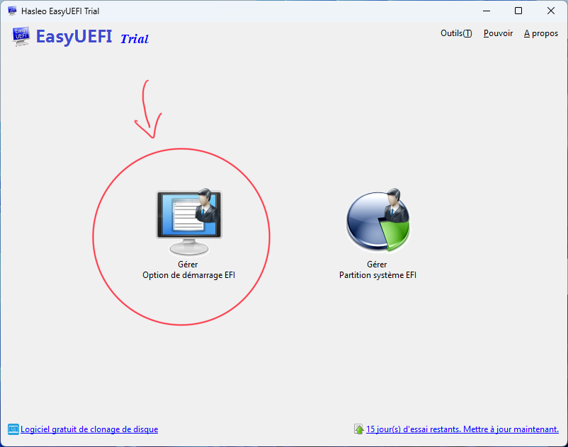
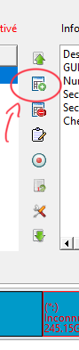
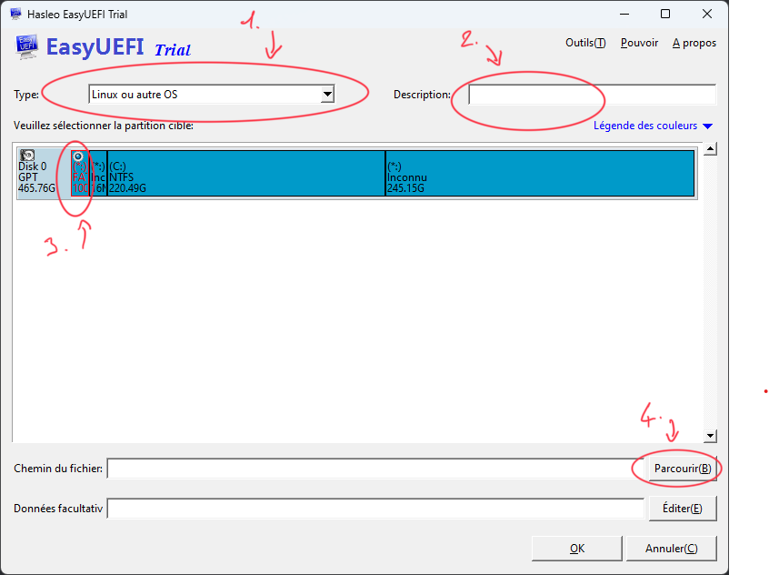
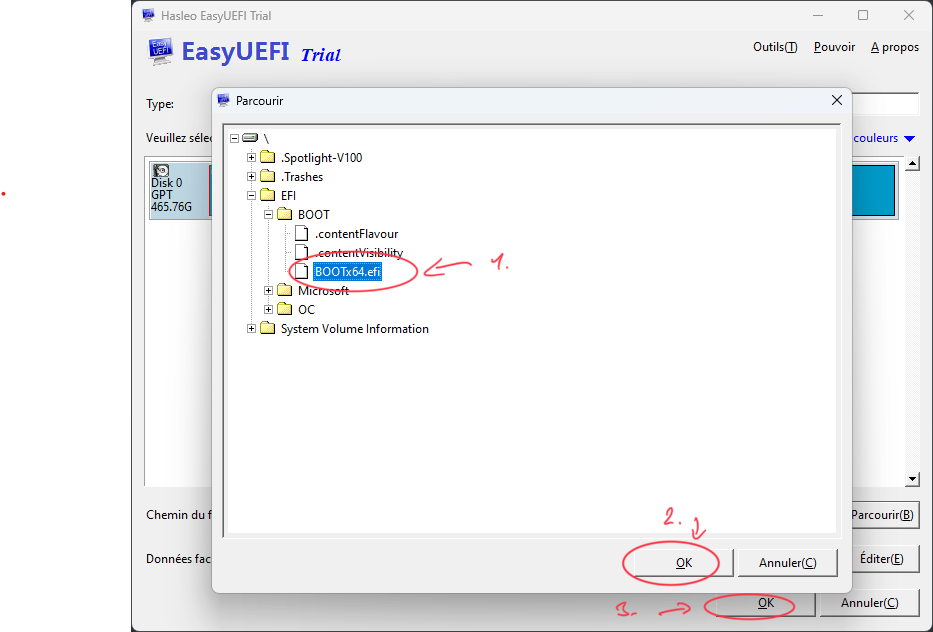

# Huawei Matebook D15 2020 Hackintosh
[Français 🇫🇷](README-fr.md) | [English 🇬🇧](README.md)

## Spécifications:
- **CPU :** Intel Core i3 1011U
- **GPU :** Intel HUD Graphics
- **RAM :** 8Go DDR4 2400 MHz
- **Modèle :** BOHB-WAX9
- **Audio :** Technologie Intel Smart Sound
- **Wifi/Bluetooth :** Intel Wireless-AC 9560 160 MHz
- **Stockage :** ~~SAMSUNG MZVLB256HBHQ-00000~~\ (Remplacé par **Crucial P3 500Go CT500P3SSD8**)

## Logiciel
- Dualboot Windows 11 / MacOS Ventura

## Marche ✅:
- Wifi
- Bluetooth
- HDMI
- Réveil / Veille
- Trackpad
- Touche de volume et de luminosité

## Ne marche pas ❌:
- Audio
- HMDI Audio

## Bugs 🔁:
- Niveau de batterie buggué *(Petite diffférence de pourcentage entre MacOS & Windows)*

## Guide
### Installation de Windows
1. Créer une clée USB bootable pour Windows avec [Rufus](https://rufus.ie/fr/)
2. Cocher la case ` Remove requirement for Secure Boot and TPM 2.0` 
3. Installer Windows normalement
4. Ouvrez l'outil de gestion des disques
5. Dans le cas ou vous avez un seul SSD, selectionnez votre partition C: et cliquez sur  `Réduire le Volume`. 
6. MacOS requiert environ 30go de stockage. Dans mon cas, mon SSD à 500go donc j'ai retiré 250go de la partition C:
7. Créer un nouveau volume simple avec le stockage non alloué et nommé le

### Installation de MacOS
1. Préparez la clée USB pour MacOS avec le [Guide OpenCore](https://dortania.github.io/OpenCore-Install-Guide/)
2. Quand vous avez finis, redémarrez votre ordinateur et entrez dans le BIOS `(F2 pour les pc portable Huawei)`
3. Désactivez le `Secure Boot`
4. Enregistez et quittez `(F10 pour les pc portable Huawei)`
5. Ouvrez le menu de boot `(F12 pour les pc portable Huawei)`
6. Sélectionnez votre clée USB bootable
7. Ouvrez l'utilitaire de disque
8. - Sélectionnez la partition que vous avez créé précédemment.
   - Formater la partition dans le format APFS

    - Cliquez sur Effacer
9. Retournez sur la page d'installation
10. Sélectionnez `Install MacOS Montery`
11. Sélectionnez votre partition
12. Attendez la fin. Si votre ordinateur redémarre faites attention à sélectionner la clée USB bootable dans le menu de boot

### Configuration et démarrage de MacOS
1. Après avoir finis la configuration, télécharger [OpenCore Configurator](https://mackie100projects.altervista.org/download-opencore-configurator/)
2. Lancez le.
3. Cliquez sur l'icon OpenCore Configurator dans la barre de status
4. Montez la partition EFI du pc portable et la partition EFI de la clée USB

5.  Copiez le contenus du dossier EFI de la clée USB dans le dossier EFI folder du pc portable (Remplacez les fichiers si nécéssaire)
6.  Dans le dossier OC/ (sur le pc portable) ouvrez config.plist, il devrait s'ouvrir avec OpenCore Configurator
7.  Changez `Launcher Option` de `Disabled` à `Short`
 
8.  Sauvegardez et fermez OpenCore Configurator. Retirez la clée USB
.  Redémarrez votre ordinateur et entrez dans le BIOS
9.  Désactivez le boot de la partition Windows (Testez pour savoir laquelle c'est)

10.  Enregistez et quittez
11.  Maintenant, votre ordinateur devrait démarrer sur le menu OpenCore et vous pourrez choisir entre Windows et MacOS

## Note: Si la partition n'apparait pas dans le BIOS
1. Démarrer votre pc sur Windows
2. Télécharger et installer la version d'essaie de [EasyUEFI](https://www.easyuefi.com/index-us.html)
3. Lancer EasyUEFI
4. Sélectionner l'option de gauche 

5. Dans la nouvelle fenêtre, selectionner le deuxième bouton en partant du haut

6. Dans la fenetre qui s'affiche modifier le Type d'OS, la description, puis choisissez la partition EFI (Normalement elle se situe tout à gauche et elle fait 100 mo). Puis cliquez sur parcour en bas à droite

7. Dans la fenêtre popup, naviguez vers le fichier BOOTx64.efi, selectiopnnez le, cliquez sur "ok" une première fois, puis une deuxième fois*

8. Vous pouvez fermez EasyUEFI et redémarrer votre pc dans le BIOS. Vous devriez maintenant y voir apparaitre la seconde partition
9. Comme toute vu au dessus, désactivez le boot de la partiton Windows en testant l'une après l'autre 