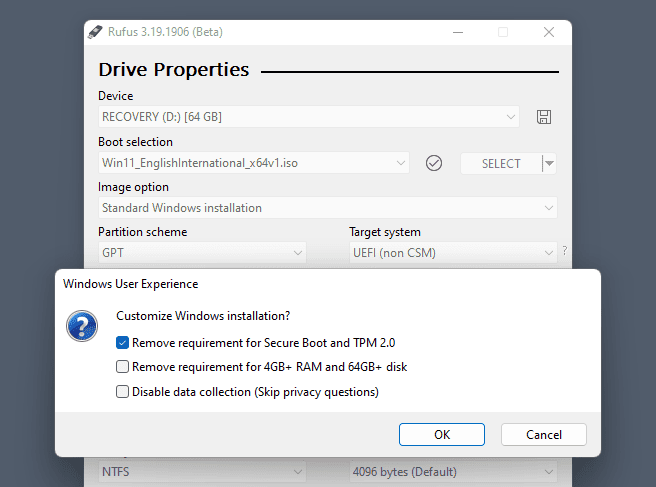
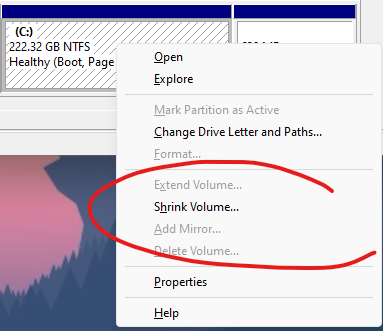
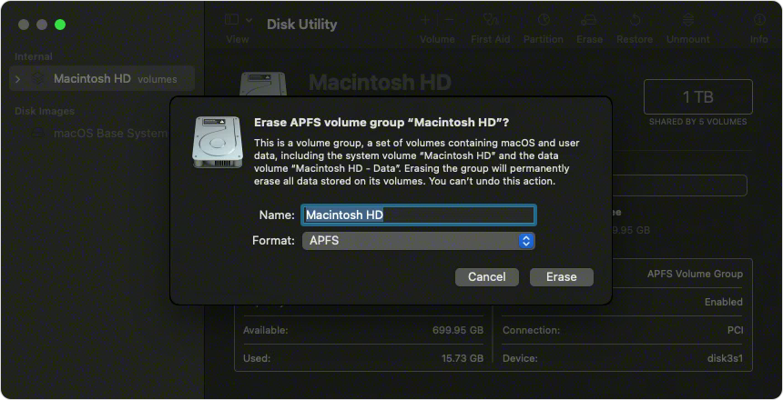
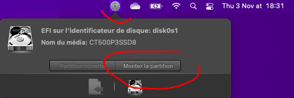
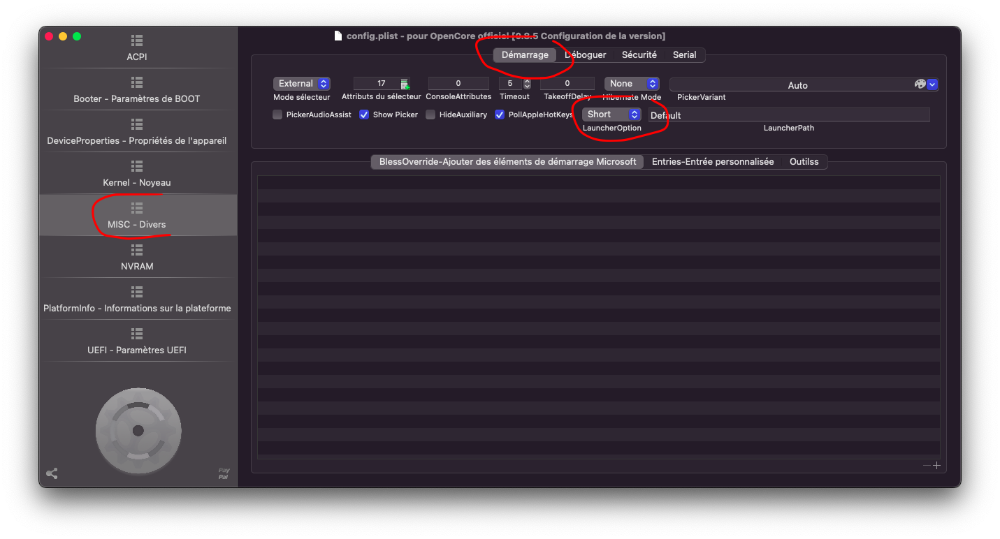
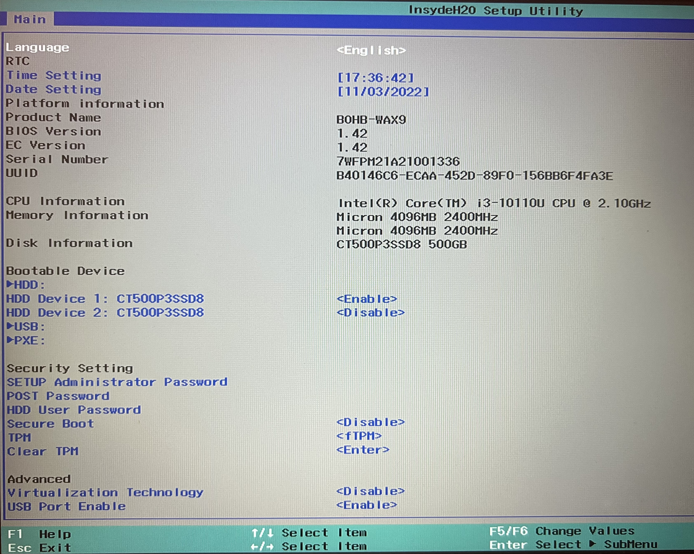

# Huawei Matebook D15 2020 Hackintosh
[Français 🇫🇷](README-fr.md) | [English 🇬🇧](README.md)

## Specs:
- **CPU :** Intel Core i3 1011U
- **GPU :** Intel HUD Graphics
- **RAM :** 8Go DDR4 2400 MHz
- **Model :** BOHB-WAX9
- **Audio :** Intel Smart Sound Technology
- **Wifi/Bluetooth :** Intel Wireless-AC 9560 160 MHz
- **Stockage :** ~~SAMSUNG MZVLB256HBHQ-00000~~\ (Replaced with **Crucial P3 500Go CT500P3SSD8**)

## Software
- Dualboot Windows 11 / MacOS Montery

## Working ✅:
- Wifi
- Bluetooth
- HDMI
- Wake / Sleep
- Trackpad
- Brightness and sound key

## Not working ❌:
- Audio
- HMDI Audio
- Battery Level buggy *(Small percentage difference between MacOS and Windows)*

## Guide
### Windows Installation
1. Create bootable USB for Windows with [Rufus](https://rufus.ie/fr/)
2. Check the box ` Remove requirement for Secure Boot and TPM 2.0` 
3. Install Windows normally
4. Open Disk Management tool
5. In case you have a single SSD, select your C: partition and click on `Shrink Volume`. 
6. MacOS requires  about 30 go of storage. In my case, my SSD has 500go so I remove 250go from the C: partition
7. Create a new simple volume with the unallocated storage and name it

### MacOS Installation
1. Prepare the USB key for MacOS with the [OpenCore Guide](https://dortania.github.io/OpenCore-Install-Guide/)
2. When it's done reboot your computer and open the BIOS `(F2 for Huawei Laptop)`
3. Disable `Secure Boot`
4. Save and exit `(F10 for Huawei Laptop)`
5. Open boot menu `(F12 for Huawei Laptop)`
6. Select your bootable USB key
7. Open disk utility
8. - Select the partition you created before
   - Format the partition with APFS format

    - Click on Erase
9. Go back to installation page
10. Select `Install MacOS Montery`
11. Select your partition
12. Wait for the end. If your computer restart be careful to select your bootable USB in boot menu
13. After finish the configuration, download [OpenCore Configurator](https://mackie100projects.altervista.org/download-opencore-configurator/)
14. Launch it.
15. Click on the OpenCore Configurator icon on the status bar
16. Mount the EFI partition of the laptop and the EFI partition of the USB

17. Copy the content of the EFI folder from the USB to the EFI folder on the laptop (Replace files if necessary)
18. In the OC/ folder (on the laptop) open config.plist, it'll open with OpenCore Configurator
19. Change `Launcher Option` from `None` to `Short`
 
20. Save and close OpenCore Configurator. Remove your USB key
21. Restart your computer and enter to BIOS
22. Disabled the boot of the Windows partition  (Test to find which one it is)

23. Save and exit
24. Now, your computer will boot to the OpenCore menu and you can choose between Windows and MacOS